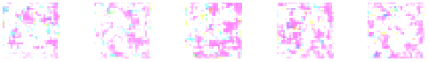

# gancam
Train a GAN on pictures from your webcam

    Install [OpenCV](https://opencv.org/) (tested on 3.4.3) 
    $ git clone https://github.com/arshamg/gancam.git
    $ cd gancam/
    $ pip install -r requirements.txt
    $ python gan.py

Smile for the camera, move around and wait for 1000 images to be captured, sit back and let the GAN train. 
Inspect training and generated images in [/images](/images).

Training examples:

    

Generated images after 10 epochs:

    

Generated images after 1000 epochs:

    

Generated images after 2000 epochs:

    

